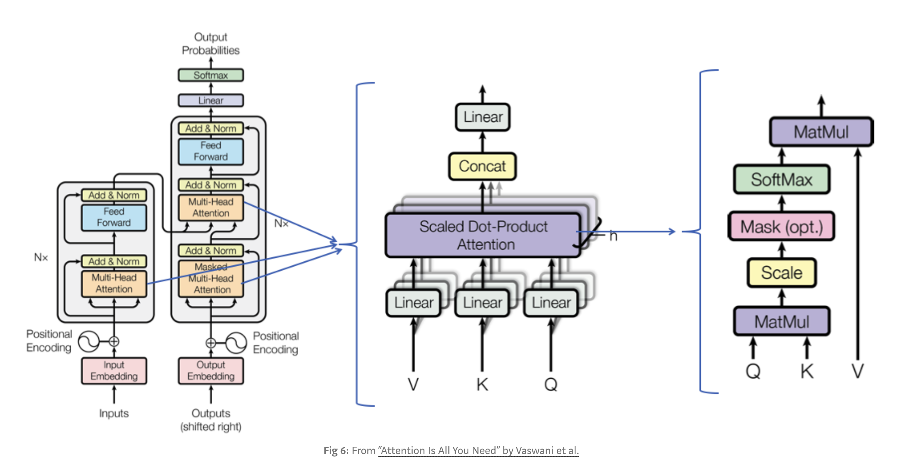
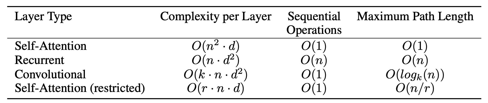
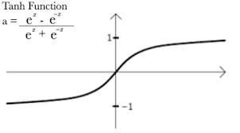
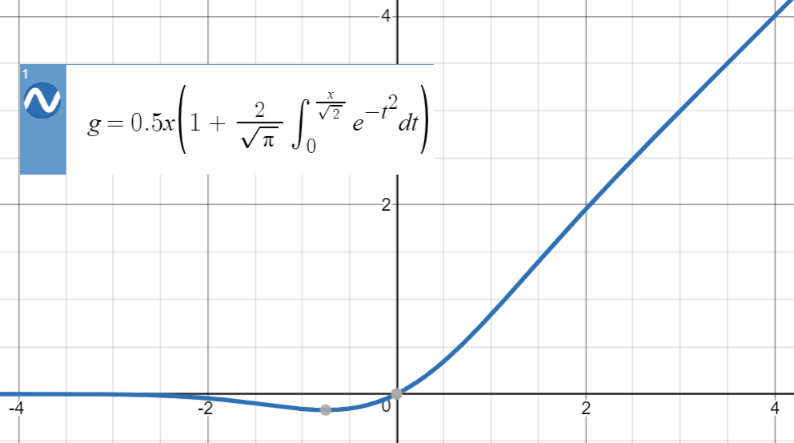

## Self Attention & CNN self-attention
## 1. Introduction

An attention function can be described as mapping a query and a set of key-value pairs to an output, where the query, keys, values, and output are all vectors. It takes in *n* inputs, and returns *n* outputs. It allows the inputs to interact with each other (“self”) and find out who they should pay more attention to (“attention”). The outputs are aggregates of these interactions and attention scores, computed as a weighted sum of the values, where the weight assigned to each value is computed by a compatibility function of the query with the corresponding key.

CNN Self Attention is similar to attention model, with a convolutionary neural network as additional layers at the begining.


## 2. Example

Say ”The animal didn't cross the street because **it** was too tired”

What does “it” in this sentence refer to? Is it referring to the street or to the animal? It’s a simple question to a human, but not as simple to an algorithm.

When the model is processing the word “it”, self-attention allows it to associate “it” with “animal”.

As the model processes each word (each position in the input sequence), self attention allows it to look at other positions in the input sequence for clues that can help lead to a better encoding for this word.


## 3. Model explain
1. Prepare inputs

2. Initialise weights

3. Derive **key**, **query** and **value**

4. Calculate attention scores for Input 1

5. Calculate softmax

6. Multiply scores with **values**

7. Calculate **weighted** **mean** to get Output 1

8. Repeat steps 4–7 for Input 2 & Input 3

   

   

   

   

```python
encoder_hypers = {
  # CNN layers
  '1dcnn_position_encoding': 'none',
	'1dcnn_layer_list': [128, 128],
  '1dcnn_kernel_width': [8, 8], 
  '1dcnn_add_residual_connections': True,
  '1dcnn_activation': 'tanh',
  
  # Attention layers
  'self_attention_activation': 'gelu',
  'self_attention_hidden_size': 128,
  'self_attention_intermediate_size': 512,
  'self_attention_num_layers': 2,
  'self_attention_num_heads': 8,
  'self_attention_pool_mode': 'weighted_mean',
}
```

##### CNN layer

Activation function: tanh

##### Attention layer

Activation function: gelu (Gaussian Error Linear Unit activation function )

2 layers with 8 heads

128 hidden sizes

512 intermediate sizes

| tanh                                          | Self Attn                                        |
| --------------------------------------------- | ------------------------------------------------ |
|  |  |


**Encoder**

The encoder in the proposed Transformer model has multiple “encoder self attention” layers. Each layer is constructed as follows:

1. The input will be the word embeddings for the first layer. For subsequent layers, it will be the output of previous layer.
2. Inside each layer, first the multi-head self attention is computed using the inputs for the layer as keys, queries and values.
3. The output of #2 is sent to a feed-forward network layer. Here every position (i.e. every word representation) is fed through the same feed-forward that contains two linear transformations followed by a GeLU (input vector ->linear transformed hidden1->linear transformed hidden2 ->GeLU output).

```python
def make_self_attention_encoder:
		
          	# Step 1
            embbed_layer(tokens)
            
            # Step 2/3
            for every layer:
                compute self-attention layer based on inputs
								Add residual connections past the first layer
                GELU activate/ dropout
                
						# Return encoder with configured pool mode
```

Input: tokens, Output: self-attention encoder

**Decoder**

The decoder will also have multiple layers. Each layer is constructed as follows:

1. The input will be the word embeddings generated so far for the first layer. For subsequent layers, it will be the output of previous layer.
2. Inside each layer, first the multi-head self attention is computed using the inputs for the layer as keys, queries and values (i.e. generated decoder outputs so far, padded for rest of positions).
3. The output of #2 is sent to a “multi-head-encoder-decoder-attention” layer. Here yet another attention is computed using #2 outputs as queries and encoder outputs as keys and values.
4. The output of #3 is sent to a position wise feed-forward network layer like in encoder.

## 4. Metrics  

| (bs=1,000)              | Self Attn | CNN Self Attn |
| ----------------------- | --------- | ------------- |
| Test-python MRR         | 0.692     | 0.632         |
| FuncNameTest-python MRR | 0.680     | 0.595         |
| Validation-python MRR   | 0.643     | 0.583         |


## Bibliography

<a href="https://arxiv.org/pdf/1706.03762.pdf">Attention is all you need</a>

<a href="https://towardsdatascience.com/illustrated-self-attention-2d627e33b20a">Illustrated: Self-Attention</a>

<a href="https://towardsdatascience.com/attn-illustrated-attention-5ec4ad276ee3">Attn: Illustrated Attention</a>

<a href="https://jalammar.github.io/illustrated-transformer/">Illustrated transformer</a>

<a href="https://openreview.net/pdf?id=HJlnC1rKPB">On the relationship between self-attention and convolutional layers</a>

